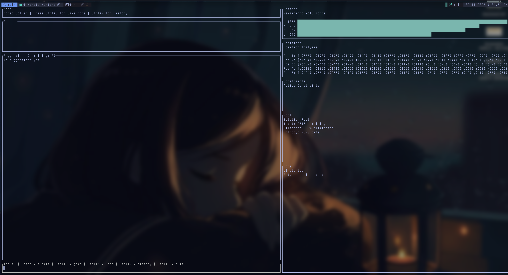
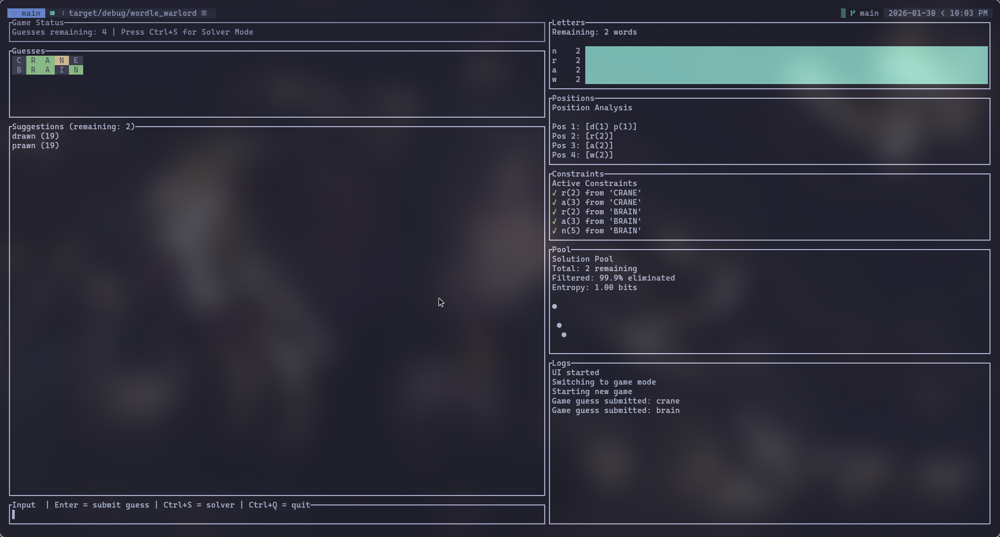
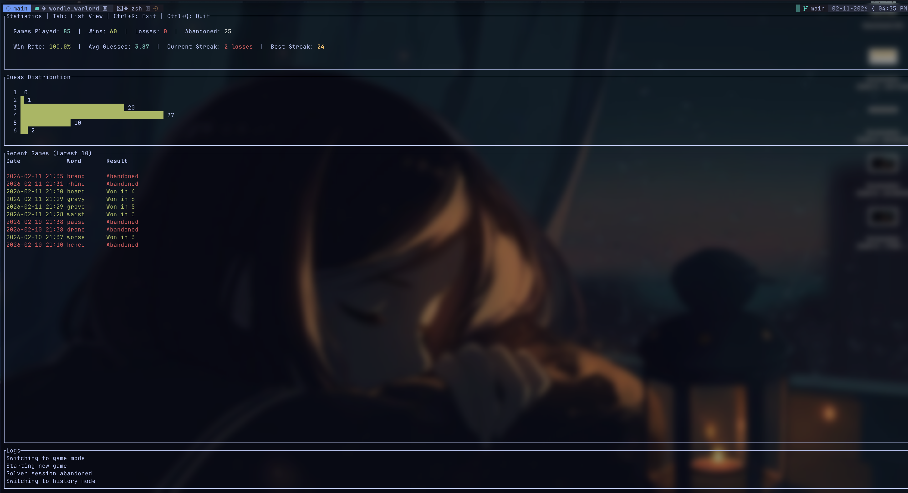
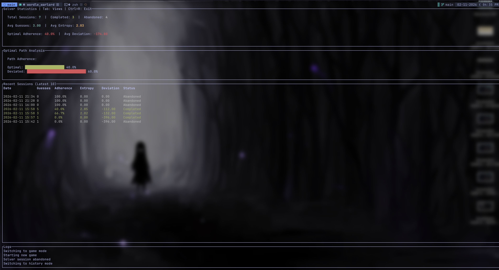
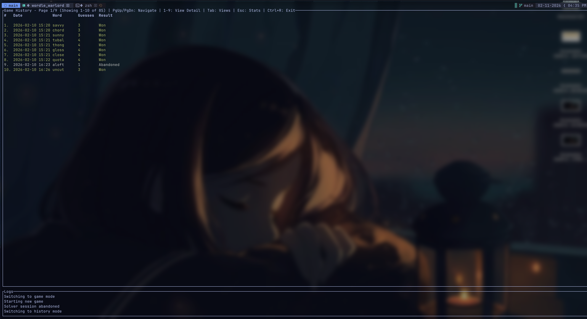
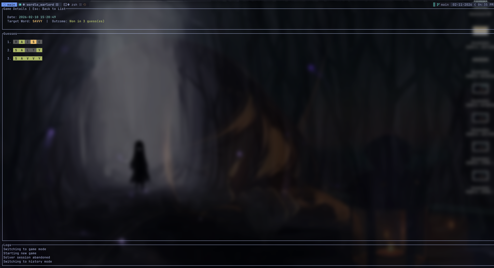

# wordle-warlord 🟩🟨⬛

A Wordle solver **and** local Wordle game written in Rust, with an interactive terminal UI and game history tracking.

`wordle-warlord` models actual Wordle rules including repeated letters, per-guess min/max constraints, and multi-guess compounding. It features three modes:

- **Solver mode** - solve real Wordle puzzles with live analysis
- **Game mode** - play Wordle locally in your terminal
- **History mode** - review past games and solver sessions with detailed statistics

What started as "I could just grep this" turned into "okay, let's actually do it right."

## Solver Mode



## Game Mode



## Game Statistics



## Solver Statistics



## Game History



## Previous Game Detail



---

## What This Is (and Isn't)

**This is:**

- A correct Wordle solver engine with live analysis
- A playable local Wordle clone
- An interactive terminal UI with history tracking
- Deterministic, test-backed solving logic
- Honest about contradictions
- A way to track and review your gameplay statistics

If the solver says "no solutions," that's not a bug it means earlier constraints contradict reality.

In other words: Wordle says you messed up.

**This is not:**

- A bot that plays Wordle online for you
- A cheat that instantly reveals the answer
- An automated solver that plays without input
- A mathematically optimal solver minimizing guesses
- Guaranteed to suggest the perfect next move
- A browser plugin or Wordle scraper

It helps you reason about the puzzle it doesn't play it for you.

---

## Features

### 🧠 Correct Wordle constraint handling

- Green / Yellow establish **minimum letter counts**
- Gray establishes **maximum counts per guess**
- Repeated-letter edge cases handled correctly
- Constraints compound across guesses like real Wordle

---

### 🎮 Play Wordle locally

- Random solution selection from official Wordle answer list
- Standard 6-guess gameplay
- Colored tile feedback
- Optional solver suggestions and analysis panels mid-game

Play normally, or cheat responsibly.

---

### 🔎 Solver mode

Enter guesses manually and narrow solutions interactively.

- Colored guess history
- Live candidate filtering
- Ranked suggestions based on letter frequency
- Undo support (Ctrl+Z)
- Constraint visualization
- Real-time analysis panels

Great for solving real NYT puzzles or learning optimal strategies.

---

### 📊 Live analysis panels

Solver and Game modes show:

- **Letter frequency breakdown** - which letters appear most in remaining candidates
- **Position likelihoods** - possible letters for each position, ranked by frequency
- **Active constraints** - summary of green/yellow/gray constraints
- **Solution pool stats** - remaining candidates, elimination rate, and information entropy

So you can actually see the solution space collapse with each guess.

Toggle analysis with `Ctrl+A` in Game mode.

---

### 📈 History and Statistics

Track your gameplay and solver sessions over time.

**Game Statistics:**

- Total games, wins, losses, abandoned
- Win rate and average guesses
- Current streak (win/loss)
- Best win streak
- Guess distribution (how often you win in 1-6 guesses)

**Solver Statistics:**

- Total solver sessions
- Average guesses per session
- Session success metrics

**History Viewer:**

- Browse past games with pagination
- View detailed game replays with feedback
- Review solver session logs
- Track performance trends

Access history with `Ctrl+R` from any mode.

---

### 🧪 Test-backed solver

Solver logic includes tests for:

- Repeated-letter behavior
- Multi-guess constraint interaction
- Known Wordle edge cases

If results are empty, the constraints are wrong — not the code.

---

## Installation

Clone and build normally:

```bash
git clone https://github.com/jscina/wordle-warlord.git
cd wordle-warlord
cargo build --release
```

Or just run it:

```bash
cargo run
```

On first run, the app downloads and caches Wordle wordlists automatically.

---

## Usage

Launch:

```bash
cargo run
```

You start in **Solver mode**.

---

### Solver Mode

Enter guesses and their feedback patterns:

```
<guess> <pattern>
```

Example:

```
daisy GXXYG
```

Pattern rules:

- `G` = correct letter, correct position (green)
- `Y` = correct letter, wrong position (yellow)
- `X` = letter not present beyond justified counts (gray)

Lowercase works too (`g`, `y`, `x`).

The solver will:

- Filter candidates based on constraints
- Show live analysis of letter frequencies and positions
- Suggest high-value next guesses
- Track constraint state

---

### Game Mode

Press `Ctrl+G` to start a local Wordle game.

Gameplay:

- Type a guess (must be a valid word)
- Press Enter
- Receive colored feedback
- Solve within 6 guesses

The game selects from the official Wordle answer list.

**Optional hints:**

- Press `Ctrl+H` to toggle solver suggestions on/off
- Press `Ctrl+A` to toggle analysis panels on/off

After game over, press Enter to start a new round.

Return to Solver mode with `Ctrl+S`.

---

### History Mode

Press `Ctrl+R` from any mode to view your game history.

**View modes** (cycle with Tab):

1. **Statistics Dashboard** - aggregate stats for all games and solver sessions
2. **Game List** - paginated list of past games (navigate with PgUp/PgDn)
3. **Game Detail** - replay a specific game with full feedback (press 1-9 in list view)
4. **Solver Statistics** - detailed solver session metrics

**Navigation:**

- `Tab` - cycle through view modes
- `PgUp/PgDn` - navigate pages in list view
- `1-9` - view game details in list view (games 1-9 on current page)
- `Esc` - return to previous view
- `Ctrl+R` - exit history and return to Solver mode

History is parsed from application logs (`logs/wordle-warlord.log.*`).

---

## Controls

| Key       | Action                          | Available In        |
| --------- | ------------------------------- | ------------------- |
| Enter     | Submit guess / start new game   | All modes           |
| Backspace | Delete character                | Solver, Game        |
| Ctrl+Q    | Quit application                | All modes           |
| Ctrl+G    | Start game mode                 | Solver              |
| Ctrl+S    | Return to solver mode           | Game                |
| Ctrl+R    | Open history viewer             | Solver, Game        |
| Ctrl+R    | Exit history viewer             | History             |
| Ctrl+Z    | Undo last guess                 | Solver              |
| Ctrl+H    | Toggle hints on/off             | Game                |
| Ctrl+A    | Toggle analysis panels on/off   | Game                |
| Tab       | Cycle history view modes        | History             |
| PgUp/PgDn | Navigate history pages          | History (list view) |
| 1-9       | View game detail                | History (list view) |
| Esc       | Return to previous history view | History             |

---

## Suggestion Ranking

Suggestions are ranked by informational value:

1. Count letter frequency among remaining solutions
2. Score words by sum of **unique letter frequencies**
3. Sort descending

Repeated letters don't give extra information, so they aren't rewarded.

---

## Wordlists

The app automatically downloads and caches two wordlists on first run:

1. **Allowed words** (`words.txt`) - all valid guesses (~13,000 words)
2. **Solution words** (`solutions.txt`) - official Wordle answers (~2,300 words)

Words are:

- Lowercase 5-letter words
- Used for both solving and gameplay
- Cached locally after first download

No configuration required.

---

## History and Logging

Game history is tracked via structured logging to `logs/wordle-warlord.log.*` files.

The history parser extracts:

- Game start/end events
- Guesses and feedback
- Win/loss outcomes
- Solver session activity

History persists across app restarts and can be reviewed in History mode.

---

## Known Behavior

The solver can legitimately return zero candidates.

This means:

- Constraints conflict
- Or feedback was entered incorrectly

That can happen in real Wordle if you make a mistake entering the pattern.

The solver is not broken when this occurs check your input.

---

## Why This Exists

Because:

- Manually tracking constraints sucks
- Correct solvers are fun to build
- Someone was way too confident about a solve in two
- And stats tracking is oddly satisfying

---

## License

Do whatever you want.

If it helps you win Wordle and feel superior, enjoy it.

If it annoys someone, even better.
